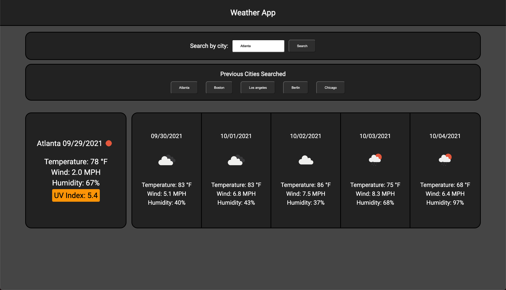

# Weather App

## Summary

The goal of this project was to create a weather dashboard where someone can look up weather data for today and the next 5 days using calls to the openweather api.

---

## Details

* Search a city for weather information.
* Last 5 cities searched are showed in a previous searched bar. Only shows last 2 cities on mobile.
* Gives weather information for today and a forecast for the next 5 days.
* Weather data for today includes an icon indicating sunny, cloudy, etc as well as the temperature in °F, the wind speed in MPH, the humidity, and the current UV index.
* The forecast contains mostly the same data but excludes the UV index.

---

## Live Site

Link to the live site [here.](https://seanovery.github.io/weather-app/)

---

## Preview

